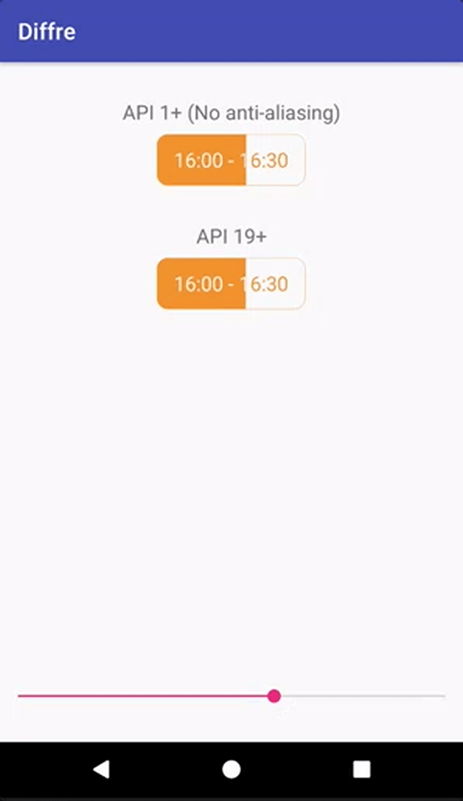

# Diffre
*pronounced - Differ*

[Stack OverFlow](http://stackoverflow.com/questions/42246509/fill-shape-with-text-with-two-different-color)

Diffre is a sample Android application that shows how to change text color based on background.

This sample application exposes two possible implementations:

* A `Path`-based implementation that requires API level 19
* A `Region`-based implementation that requires API level 1

*Heavily influenced from [Romain Guy's Medium article](https://medium.com/@romainguy/a-better-underline-for-android-90ba3a2e4fb#.v4xblse45)*

<p align="center">

</p>

<p align="center">

</p>

## Limitations
* Even though Region API works from API 1+, many devices I've encountered don't render it unless `layerType="software"` is specified. So this effectively makes Region API useful only from API 11.

## Contact
[Email](mailto:rakshakhegde@gmail.com) | [Twitter](https://twitter.com/rakshakhegde)

## License
```txt
Copyright 2016 Rakshak Hegde

Licensed under the Apache License, Version 2.0 (the "License");
you may not use this file except in compliance with the License.
You may obtain a copy of the License at

    http://www.apache.org/licenses/LICENSE-2.0

Unless required by applicable law or agreed to in writing, software
distributed under the License is distributed on an "AS IS" BASIS,
WITHOUT WARRANTIES OR CONDITIONS OF ANY KIND, either express or implied.
See the License for the specific language governing permissions and
limitations under the License.
```
